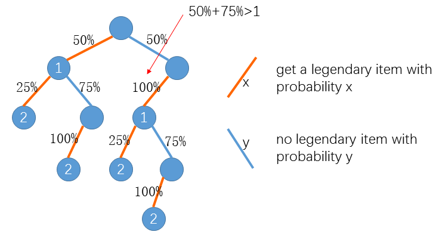
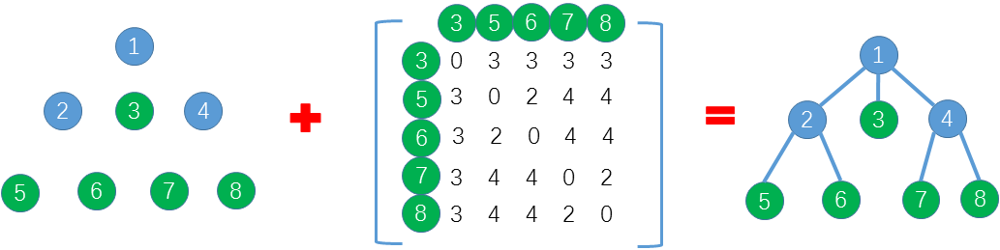

###微软2017年预科生计划在线编程笔试题目题解

Legendary Items
=====

Description
----
Little Hi is playing a video game. Each time he accomplishes a quest in the game, Little Hi has a chance to get a legendary item.

At the beginning the probability is P%. Each time Little Hi accomplishes a quest without getting a legendary item, the probability will go up Q%. Since the probability is getting higher he will get a legendary item eventually.

After getting a legendary item the probability will be reset to ⌊P/(2^I)⌋% (⌊x⌋ represents the largest integer no more than x) where I is the number of legendary items he already has. The probability will also go up Q% each time Little Hi accomplishes a quest until he gets another legendary item.

Now Little Hi wants to know the expected number of quests he has to accomplish to get N legendary items.

Assume P = 50, Q = 75 and N = 2, as the below figure shows the expected number of quests is



```2*50%*25% + 3*50%*75%*100% + 3*50%*100%*25% + 4*50%*100%*75%*100% = 3.25```

Input
----
The first line contains three integers P, Q and N.

1<=N<=10^6, 0<=P<=100, 1<=Q<=100

Output
----

Output the expected number of quests rounded to 2 decimal places.

Sample Input
-----

50 75 2

Sample Output
----

3.25


Tree Restoration
======

Description
-----

There is a tree of N nodes which are numbered from 1 to N. Unfortunately, its edges are missing so we don't know how the nodes are connected. Instead we know:

1. Which nodes are leaves
2. The distance (number of edges) between any pair of leaves
3. The depth of every node (the root's depth is 1)
4. For the nodes on the same level, their order from left to right

Can you restore the tree's edges with these information? Note if node u is on the left of node v, u's parent should not be on the right of v's parent.



Input
----
The first line contains three integers N, M and K. N is the number of nodes. M is the depth of the tree. K is the number of leaves.
The second line contains M integers A1, A2, ... AM. Ai represents the number of nodes of depth i.
Then M lines follow. The ith of the M lines contains Ai numbers which are the nodes of depth i from left to right.
The (M+3)-th line contains K numbers L1, L2, ... LK, indicating the leaves.
Then a K x K matrix D follows. Dij represents the distance between Li and Lj.

1 <= N <= 100

Output
----
For every node from 1 to N output its parent. Output 0 for the root's parent.

Sample Input
-----
8 3 5  
1 3 4  
1  
2 3 4  
5 6 7 8  
3 5 6 7 8  
0 3 3 3 3  
3 0 2 4 4  
3 2 0 4 4  
3 4 4 0 2  
3 4 4 2 0  

Sample Output
-----
0 1 1 1 2 2 4 4


Maze Escape
=====

Description
----

In a video game Little Hi is trapped in a maze. The maze can be considered as an N x M grid. There are monsters on some cells. Each cell has one monster at most. Below is an example of a 4x5 maze. '.' represents an empty cell. 'D' represents the entrance, Little Hi's starting point. 'M' represents a normal monster. 'S' represents a special monster.

```
..S..
M...M
..D..
.M...
```

At the beginning, each cell is covered by a slate except that the slate on the entrance cell has been already removed. Each round Little Hi may either remove a slate as long as

1. each monster has either been killed or still covered by a slate, and
2. the cell covered by the slate is adjacent to some cell whose slate has been already removed. (Two cells are adjacent if they share a common side.)

or attack a monster as long as the slate covering it has been removed.

At the beginning Little Hi has Hp hit points and Ap attack points. Each monster also has its hit points Hi and attack points Ai. When Little Hi attacks a monster, the hit points of both sides should subtract the attack points of the other side.

For example, if Little Hi's hit points are 50 and attack points are 30. When he attacks a monster whose hit points are 25 and attack points are 10, the remaining hit points for Little Hi are 40 and the remaining hit points for the monster are -5.

When hit points are less than or equal to 0 the monster is killed.

At the beginning Little Hi has a buff called "Destruction Blade" which lasts for 5 rounds. With such buff Little Hi does not take damage when he attacks a monster. The buff vanishes after 5 rounds but can be refreshed or regained for the following 5 rounds after killing a special monster. (Note that the buff always lasts for 5 rounds after killing a special monster no matter how many rounds left before killing the monster.)

Now given the map of the maze. Can you tell whether Little Hi can kill all the monsters? If he can what is the maximum remaining hit points?

Input
----
Line 1: two integers N and M. (2 <= N, M <= 6, N x M <= 20)
Line 2 .. N+1: M characters per line, representing the maze map.
Line N+2 .. N+K+1: two integers Hi and Ai per line, representing the hit points and attack points for each monster, from top to bottom and left to right. (3 <= K <= 7)
Line N+K+2: two integers Hp and Ap, the hit points and attack points for Little Hi.

Output
----
If Little Hi can kill all the monsters and stay alive output the maximum remaining hit points. Otherwise output DEAD.

Sample Input
----
4 5  
..S..  
M...M  
..D..  
.M...  
20 5  
20 5  
20 5  
20 5  
60 10  

Sample Output
----
45

Sample Explaination
-----
Let's assume the upper left cell is (1, 1).  
Round 1: remove slate (2, 3), buff remains 4 rounds  
Round 2: remove slate (2, 2), buff remains 3 rounds  
Round 3: remove slate (2, 1), buff remains 2 rounds  
Round 4: attack monster (2, 1), take no damage, buff remains 1 round  
Round 5: attack monster (2, 1), take no damage, monster killed, buff vanishes  
Round 6: remove slate (2, 4)  
Round 7: remove slate (4, 3)  
Round 8: remove slate (1, 3)  
Round 9: attack monster (1, 3), take 5 damage, HP=55  
Round 10: attack monster (1, 3), take 5 damage, HP=50, monster killed, buff remains 5 rounds  
Round 11: remove slate (2, 5), buff remains 4 rounds  
Round 12: attack monster (2, 5) take no damage, buff remains 3 rounds  
Round 13: attack monster (2, 5) take no damage, buff remains 2 rounds  
Round 14: remove slate (4, 2), buff remains 1 round  
Round 15: attack monster (4, 2), take no damage, buff vanishes  
Round 16: attack monster (4, 2), take 5 damage, HP=45, monster killed  


Parentheses Sequence
=====

Description
----

You are given a sequence S of parentheses. You are asked to insert into S as few parentheses as possible so that the resulting sequence T is well matched.

It's not difficult. But can you tell how many different T you can get?

Assume S = ()), you can get either (()) or ()().

Input
----
One line contains the sequence S.

For 30% of the data, 1<=|S|<=10  
For 60% of the data, 1<=|S|<=200  
For 100% of the data, 1<=|S|<=1000   

Output
----

Output 2 integers indicating the minimum number of parentheses need to be inserted into S and the number of different T. The number of different T may be very large, so output the answer modulo 10^9+7.

Sample Input
-----

())

Sample Output
----

1 2


